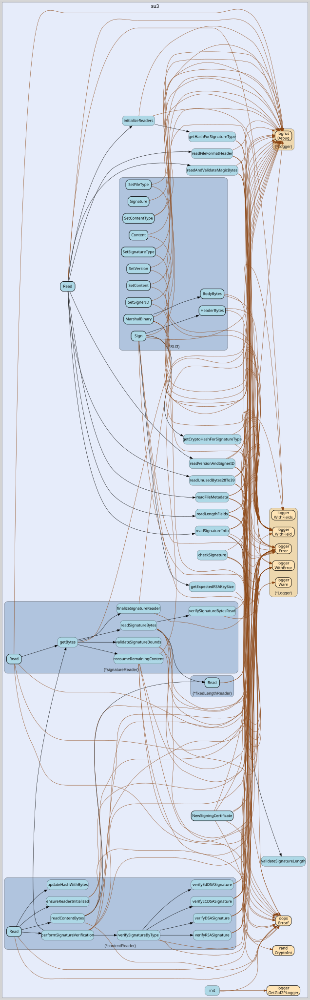

# su3
--
    import "github.com/go-i2p/su3"



Package su3 implements reading the SU3 file format.

SU3 files provide content that is signed by a known identity. They are used to
distribute many types of data, including reseed files, plugins, blocklists, and
more.

See: https://geti2p.net/spec/updates#su3-file-specification

The Read() function takes an io.Reader, and it returns a *SU3. The *SU3 contains
the SU3 file metadata, such as the type of the content and the signer ID. In
order to get the file contents, one must pass in the public key associated with
the file's signer, so that the signature can be validated. The content can still
be read without passing in the key, but after returning the full content the
error ErrInvalidSignature will be returned.

Example usage:

        // Let's say we are reading an SU3 file from an HTTP body, which is an io.Reader.
        su3File, err := su3.Read(body)
        if err != nil {
            // Handle error.
        }
        // Look up this signer's key.
        key := somehow_lookup_the_key(su3File.SignerID)
        // Read the content.
        contentReader := su3File.Content(key)
        bytes, err := ioutil.ReadAll(contentReader)
        if errors.Is(err, su3.ErrInvalidSignature) {
    	       // The signature is invalid, OR a nil key was provided.
        } else if err != nil {
            // Handle error.
        }

If you want to parse from a []byte, you can wrap it like this:

    mySU3FileBytes := []byte{0x00, 0x01, 0x02, 0x03}
    su3File, err := su3.Read(bytes.NewReader(mySU3FileBytes))

One of the advantages of this library's design is that you can avoid buffering
the file contents in memory. Here's how you would stream from an HTTP body
directly to disk:

        su3File, err := su3.Read(body)
        if err != nil {
    	       // Handle error.
        }
        // Look up this signer's key.
        key := somehow_lookup_the_key(su3File.SignerID)
        // Stream directly to disk.
        f, err := os.Create("my_file.txt")
        if err != nil {
    	       // Handle error.
        }
        _, err := io.Copy(f, su3File.Content(key))
        if errors.Is(err, su3.ErrInvalidSignature) {
    	       // The signature is invalid, OR a nil key was provided.
            // Don't trust the file, delete it!
        } else if err != nil {
            // Handle error.
        }

Note: if you want to read the content, the Content() io.Reader must be read
*before* the Signature() io.Reader. If you read the signature first, the content
bytes will be thrown away. If you then attempt to read the content, you will get
an error. For clarification, see TestReadSignatureFirst.

## Usage

```go
var (
	ErrMissingMagicBytes        = oops.Errorf("missing magic bytes")
	ErrMissingUnusedByte6       = oops.Errorf("missing unused byte 6")
	ErrMissingFileFormatVersion = oops.Errorf("missing or incorrect file format version")
	ErrMissingSignatureType     = oops.Errorf("missing or invalid signature type")
	ErrUnsupportedSignatureType = oops.Errorf("unsupported signature type")
	ErrMissingSignatureLength   = oops.Errorf("missing signature length")
	ErrMissingUnusedByte12      = oops.Errorf("missing unused byte 12")
	ErrMissingVersionLength     = oops.Errorf("missing version length")
	ErrVersionTooShort          = oops.Errorf("version length too short")
	ErrMissingUnusedByte14      = oops.Errorf("missing unused byte 14")
	ErrMissingSignerIDLength    = oops.Errorf("missing signer ID length")
	ErrMissingContentLength     = oops.Errorf("missing content length")
	ErrContentLengthTooLarge    = oops.Errorf("content length exceeds maximum allowed size")
	ErrSignatureLengthTooLarge  = oops.Errorf("signature length exceeds maximum allowed size")
	ErrMissingUnusedByte24      = oops.Errorf("missing unused byte 24")
	ErrMissingFileType          = oops.Errorf("missing or invalid file type")
	ErrMissingUnusedByte26      = oops.Errorf("missing unused byte 26")
	ErrMissingContentType       = oops.Errorf("missing or invalid content type")
	ErrMissingUnusedBytes28To39 = oops.Errorf("missing unused bytes 28-39")
	ErrMissingVersion           = oops.Errorf("missing version")
	ErrMissingSignerID          = oops.Errorf("missing signer ID")
	ErrMissingContent           = oops.Errorf("missing content")
	ErrMissingSignature         = oops.Errorf("missing signature")
	ErrInvalidPublicKey         = oops.Errorf("invalid public key")
	ErrInvalidSignature         = oops.Errorf("invalid signature")
	ErrInvalidSignatureLength   = oops.Errorf("signature length invalid for signature type")
)
```
Error variables define all possible errors that can occur during SU3 processing.
Moved from: su3.go

#### func  NewSigningCertificate

```go
func NewSigningCertificate(signerID string, privateKey *rsa.PrivateKey) ([]byte, error)
```
NewSigningCertificate creates a self-signed X.509 certificate for SU3 file
signing. It generates a certificate with the specified signer ID and RSA private
key for use in I2P reseed operations. The certificate is valid for 10 years and
includes proper key usage extensions for digital signatures.

Parameters:

    - signerID: The common name and subject key ID for the certificate
    - privateKey: The RSA private key used to sign the certificate

Returns the DER-encoded certificate bytes or an error if generation fails.

#### type ContentType

```go
type ContentType string
```

ContentType represents the type of content contained within the SU3 file. Moved
from: su3.go

```go
const (
	UNKNOWN       ContentType = "unknown"
	ROUTER_UPDATE ContentType = "router_update"
	PLUGIN        ContentType = "plugin"
	RESEED        ContentType = "reseed"
	NEWS          ContentType = "news"
	BLOCKLIST     ContentType = "blocklist"
)
```
ContentType constants define supported content types. Moved from: su3.go

#### type FileType

```go
type FileType string
```

FileType represents the type of file contained within the SU3 archive. Moved
from: su3.go

```go
const (
	ZIP      FileType = "zip"
	XML      FileType = "xml"
	HTML     FileType = "html"
	XML_GZIP FileType = "xml.gz"
	TXT_GZIP FileType = "txt.gz"
	DMG      FileType = "dmg"
	EXE      FileType = "exe"
)
```
FileType constants define supported file types. Moved from: su3.go

#### type SU3

```go
type SU3 struct {
	SignatureType   SignatureType
	SignatureLength uint16
	ContentLength   uint64
	FileType        FileType
	ContentType     ContentType
	Version         string
	SignerID        string
}
```

SU3 represents a parsed SU3 file with its metadata and content readers. Extended
to support both reading existing SU3 files and creating new ones. Moved from:
su3.go

#### func  New

```go
func New() *SU3
```
New creates a new SU3 file with default settings and current timestamp. The file
is initialized with RSA-SHA512 signature type and a Unix timestamp version.
Additional fields must be set before signing and distribution.

#### func  Read

```go
func Read(reader io.Reader) (su3 *SU3, err error)
```
Read parses an SU3 file from the provided io.Reader and returns a *SU3 instance.
The returned SU3 contains metadata about the file and provides access to content
and signature. Moved from: su3.go

#### func (*SU3) BodyBytes

```go
func (su3 *SU3) BodyBytes() []byte
```
BodyBytes generates the binary representation of the SU3 file without the
signature. This includes the magic header, metadata fields, and content data in
the proper SU3 format.

#### func (*SU3) Content

```go
func (su3 *SU3) Content(publicKey interface{}) io.Reader
```
Content returns an io.Reader for accessing the SU3 file content. The publicKey
parameter is used for signature verification during reading. If publicKey is
nil, content can be read but ErrInvalidSignature will be returned.

CRITICAL READ ORDER REQUIREMENT: If you want to read both content and signature,
the Content() io.Reader MUST be read *before* the Signature() io.Reader. This
limitation exists because SU3 files are a streaming format where content and
signature are sequential.

SIDE EFFECTS OF READING SIGNATURE() FIRST: When you read from Signature() before
reading Content(), the signature reader will automatically consume and discard
ALL remaining content bytes to position the stream correctly for signature
reading. This means:

    - Any unread content data is permanently lost
    - Subsequent calls to Content() will return an empty reader
    - No error is generated, but content access is no longer possible

WORKAROUNDS:

    1. Always read Content() before Signature() if you need both
    2. If you only need signature verification without content access,
       you can safely read Signature() directly
    3. For scenarios requiring signature-first access, consider using
       bytes.Buffer or similar to fully buffer the SU3 data first

EXAMPLE - Correct order for accessing both:

    contentReader := su3File.Content(publicKey)
    content, err := io.ReadAll(contentReader)  // Read content first
    if err != nil { /* handle error */ }

    signatureReader := su3File.Signature()     // Now safe to read signature
    signature, err := io.ReadAll(signatureReader)

For test cases demonstrating this behavior, see TestReadSignatureFirst. Moved
from: su3.go

#### func (*SU3) HeaderBytes

```go
func (su3 *SU3) HeaderBytes() []byte
```
HeaderBytes generates just the SU3 header without content or signature. This is
used for signature generation and matches what the parser stores in
buff.Bytes().

#### func (*SU3) MarshalBinary

```go
func (su3 *SU3) MarshalBinary() ([]byte, error)
```
MarshalBinary serializes the complete SU3 file including signature to binary
format. This produces the final SU3 file data that can be written to disk or
transmitted. The signature must be set before calling this method for a valid
SU3 file.

#### func (*SU3) SetContent

```go
func (su3 *SU3) SetContent(content []byte)
```
SetContent sets the content data for the SU3 file.

#### func (*SU3) SetContentType

```go
func (su3 *SU3) SetContentType(contentType ContentType)
```
SetContentType sets the content type for the SU3 file.

#### func (*SU3) SetFileType

```go
func (su3 *SU3) SetFileType(fileType FileType)
```
SetFileType sets the file type for the SU3 file.

#### func (*SU3) SetSignatureType

```go
func (su3 *SU3) SetSignatureType(signatureType SignatureType)
```
SetSignatureType sets the signature type for the SU3 file.

#### func (*SU3) SetSignerID

```go
func (su3 *SU3) SetSignerID(signerID string)
```
SetSignerID sets the signer ID for the SU3 file.

#### func (*SU3) SetVersion

```go
func (su3 *SU3) SetVersion(version string)
```
SetVersion sets the version string for the SU3 file.

#### func (*SU3) Sign

```go
func (su3 *SU3) Sign(privateKey *rsa.PrivateKey) error
```
Sign cryptographically signs the SU3 file using the provided RSA private key.
The signature covers the file header and content but not the signature itself.
The signature length is automatically determined by the RSA key size. Returns an
error if the private key is nil or signature generation fails.

#### func (*SU3) Signature

```go
func (su3 *SU3) Signature() io.Reader
```
Signature returns an io.Reader for accessing the SU3 file signature bytes.

IMPORTANT STREAMING BEHAVIOR: Reading from this signature reader will
automatically consume any unread content bytes from the underlying stream to
correctly position for signature reading. This has the following implications:

    - If Content() has not been fully read, all remaining content data
      will be discarded when Signature() is first accessed
    - This makes subsequent Content() calls return empty readers
    - No error occurs, but content access becomes impossible

USAGE PATTERNS: 1. Signature-only access (safe): Call Signature() directly
without Content() 2. Both content and signature: Read Content() completely
before Signature() 3. Manual verification workflows: Read signature bytes for
custom crypto

The signature reader provides the raw signature bytes as stored in the SU3 file.
For automatic signature verification, use Content(publicKey) instead.

Moved from: su3.go

#### type SignatureType

```go
type SignatureType string
```

SignatureType represents the type of cryptographic signature used in SU3 files.
Moved from: su3.go

```go
const (
	DSA_SHA1               SignatureType = "DSA-SHA1"
	ECDSA_SHA256_P256      SignatureType = "ECDSA-SHA256-P256"
	ECDSA_SHA384_P384      SignatureType = "ECDSA-SHA384-P384"
	ECDSA_SHA512_P521      SignatureType = "ECDSA-SHA512-P521"
	RSA_SHA256_2048        SignatureType = "RSA-SHA256-2048"
	RSA_SHA384_3072        SignatureType = "RSA-SHA384-3072"
	RSA_SHA512_4096        SignatureType = "RSA-SHA512-4096"
	EdDSA_SHA512_Ed25519ph SignatureType = "EdDSA-SHA512-Ed25519ph"
)
```
SignatureType constants define supported signature algorithms. Moved from:
su3.go


su3 

github.com/go-i2p/su3

[go-i2p template file](/template.md)
